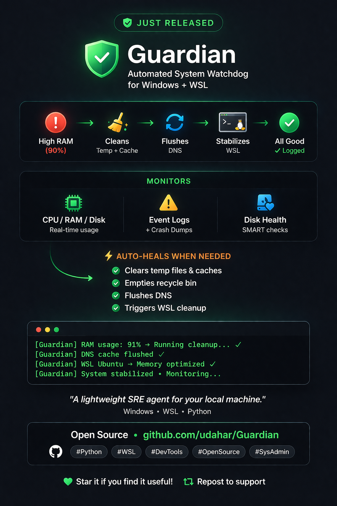

# Guardian 🛡️

**Automated System Watchdog for Windows + WSL**

Guardian is a lightweight system agent that monitors, diagnoses, and auto-heals your machine in real time.

If your system slows down, leaks memory, or accumulates junk…
Guardian detects it and fixes it — automatically.

---

## ⚡ What It Does

Guardian runs continuously and:

* Monitors CPU, RAM, disk, and system performance
* Analyzes Windows event logs and crash dumps
* Checks disk health (SMART data where available)
* Cleans temp files, caches, DNS, and system clutter
* Triggers WSL cleanup when Windows is under pressure
* Generates detailed diagnostic reports (JSON / HTML)

---

## 🔥 Example: Auto-Healing in Action

When your system crosses thresholds:

RAM > 85%
→ Clear temp files
→ Flush DNS cache
→ Clean Prefetch + recycle bin
→ Trigger WSL cleanup
→ Log action + continue monitoring

No manual cleanup. No guesswork.

---

## 🧠 Why Guardian Exists

Windows slows down.
WSL leaks memory.
Logs pile up.
Crash dumps sit unnoticed.

Guardian acts like a local SRE agent for your machine:

Detect problems → Diagnose cause → Apply fixes → Keep running

---

## 🚀 Quick Start

### Install dependencies

pip install psutil wmi

---

### Run a quick health check

from Guardian import quick_health_check

health = quick_health_check()
print(health)

---

### Run full diagnostics

from Guardian import run_diagnostics

results = run_diagnostics(days=7, output="report.json")

---

### Start continuous monitoring

from Guardian import Guardian

guardian = Guardian()
guardian.start()

---

## 🧩 Modules

### Diagnostics

* Event log analysis (System / Application / Security)
* Crash dump detection
* Boot performance analysis
* Report generation (HTML / JSON)

### Windows Guardian

* Resource monitoring (CPU / RAM / disk)
* Automated cleanup:

  * temp files
  * recycle bin
  * DNS cache
  * browser cache
  * prefetch
* Configurable thresholds

### WSL Guardian

* Monitors Linux resource usage inside WSL
* Cleans and stabilizes WSL environments
* Triggered automatically from Windows events

### Unified Guardian

* Combines Windows + WSL monitoring
* Cross-triggering cleanup and healing
* Runs continuously or for a fixed duration

---

## ⚙️ Example Configuration

from Guardian import WindowsConfig

config = WindowsConfig(
ram_threshold=85,
disk_threshold=90,
cpu_threshold=90,
auto_heal=True
)

---

## 🛠 CLI Usage

# Run diagnostics

python -m Guardian.diagnostics --print

# Continuous monitoring

python -m Guardian.windows_guardian

# Run cleanup only

python -m Guardian.windows_guardian --cleanup temp recycle_bin dns

---

## 🧪 Use Cases

* Dev machines that slow down over time
* WSL environments with memory pressure
* Diagnosing crashes and system instability
* Automated maintenance without babysitting

---

## 🧱 Tech Stack

* Python 3.8+
* psutil
* WMI (Windows integration)

---

## 🧭 Roadmap

* [ ] Centralized logging system
* [ ] Plugin system for custom cleanup actions
* [ ] Remote monitoring / dashboard (optional)
* [ ] Integration with AI orchestration (Alfred)

---

## 🧨 Philosophy

Guardian is built on one idea:

Your system should fix itself before you notice it’s broken.

---

## 📜 License

MIT
